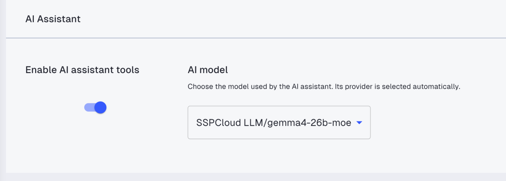

# Utiliser des modèles d’IA dans le Datalab

Le Datalab du SSP Cloud permet de connecter des **fournisseurs de modèles d’IA (AI providers)** à vos services interactifs.

Le SSP Cloud met à votre disposition le fournisseur **SSP Cloud LLM**. Vous pouvez également ajouter vos propres fournisseurs, puis choisir les modèles que vous souhaitez rendre disponibles dans vos services.

Une fois configurés, vos fournisseurs et modèles peuvent être utilisés directement depuis les services compatibles lancés dans le Datalab.

### Comment ça fonctionne ?

Le principe peut être résumé en trois étapes :

**1. Connecter un fournisseur → 2. Choisir vos modèles → 3. Les utiliser dans vos services**

---

## 1. Accéder à vos fournisseurs d’IA

Rendez-vous dans :

**Mon compte → AI Providers**

Cette page regroupe les fournisseurs d’IA disponibles pour votre compte.


<small>Retrouvez vos fournisseurs et modèles depuis My Account → AI Providers.</small>

Vous pouvez y retrouver deux types de fournisseurs :

### SSP Cloud LLM

**SSP Cloud LLM** est le fournisseur d’IA proposé par le SSP Cloud.

Il utilise une authentification **OpenID Connect (OIDC)**. Pour y accéder, vous devez disposer d’un compte sur [Open WebUI du SSP Cloud](https://llm.lab.sspcloud.fr/).

### Fournisseurs personnalisés

Vous pouvez également ajouter votre propre fournisseur lorsque celui-ci est compatible avec le Datalab.

Cela vous permet par exemple d'utiliser un service d'IA externe auquel vous avez déjà accès.

---

## 2. Connecter un fournisseur

L'état de connexion est indiqué directement sur chaque fournisseur :

**Connected**  
Le fournisseur est prêt à être utilisé.

**Setup required**  
Une configuration ou une authentification est nécessaire avant de pouvoir l'utiliser.

**Connection error**  
Le Datalab ne parvient pas à se connecter au fournisseur. Vérifiez vos informations de connexion ou réessayez.

Pour un fournisseur nécessitant une configuration, ouvrez **Manage** et renseignez les informations demandées.

> Pour un fournisseur personnalisé, les informations demandées dépendent de son mode d’authentification.


<small>Chaque fournisseur indique son état de connexion.</small>

---

## 3. Ajouter votre propre fournisseur

Sélectionnez **Add a new custom AI provider** depuis la page AI Providers.

Choisissez d'abord le type de fournisseur que vous souhaitez connecter, puis renseignez les informations nécessaires, par exemple :

-   le nom que vous souhaitez lui donner ;
-   l'URL de son API ;
-   votre clé API, lorsqu'elle est nécessaire.

Utilisez **Test connection** pour vérifier la connexion.

Une fois la connexion établie, le Datalab récupère les modèles disponibles auprès du fournisseur.

Vous pouvez alors sélectionner ceux que vous souhaitez utiliser et ajouter le fournisseur à votre compte.


<small>Ajoutez vos informations de connexion et testez votre provider.</small>

---

## 4. Choisir les modèles disponibles

Un fournisseur peut donner accès à plusieurs modèles.

Depuis **AI Providers**, sélectionnez les modèles que vous souhaitez rendre disponibles dans vos services.

Vous n'avez donc pas besoin d'activer l'ensemble du catalogue proposé par le fournisseur : vous pouvez conserver uniquement les modèles dont vous avez besoin.

Vous pouvez modifier cette sélection à tout moment depuis la liste des fournisseurs ou depuis **Manage**.


<small>Choisissez les modèles que vous souhaitez utiliser.</small>

### Modèle par défaut

Vous pouvez également choisir un **modèle par défaut**.

Lorsqu'un service compatible avec les fournisseurs d'IA est lancé, ce modèle peut être utilisé comme choix initial.

Cela n'empêche pas de sélectionner un autre modèle depuis la configuration du service, s'il a été sélectionné dans la liste des fournisseurs.

---

## 5. Utiliser vos modèles dans un service

Une fois vos fournisseurs configurés, le Datalab rend leurs informations de connexion et les modèles sélectionnés disponibles aux **services interactifs compatibles**.

Vous pouvez ainsi utiliser vos modèles depuis votre environnement de travail sans avoir à reconfigurer manuellement votre fournisseur à chaque lancement.

Selon le service utilisé, vous pourrez également choisir ou changer le modèle utilisé.

> La manière dont les modèles sont utilisés dépend du service. Tous les services du catalogue ne prennent pas nécessairement en charge les fournisseurs d'IA.



<small>Retrouvez vos modèles lors de la configuration d'un service compatible.</small>

### Dans VS Code

Dans VS Code, ouvrez **Continue** depuis la barre d'onglets à gauche pour utiliser vos modèles.

### Depuis le terminal de VS Code, RStudio ou Jupyter

Si **OpenCode** est installé dans votre service, ouvrez un terminal dans le dossier de votre projet et lancez la commande :

```bash
opencode
```

---

## 6. Gérer un fournisseur

Sélectionnez **Manage** sur un fournisseur pour retrouver ses paramètres.

Vous pouvez notamment :

**Connection details**  
Consulter les informations utilisées par le Datalab pour se connecter au fournisseur et tester la connexion.

**Manage models**  
Ajouter ou retirer les modèles que vous souhaitez utiliser.

**Documentation**  
Accéder à la documentation du fournisseur, de son API ou des modèles disponibles.

Pour **SSP Cloud LLM**, certains paramètres sont gérés par l’équipe du SSP Cloud et ne sont pas modifiables depuis votre compte.
