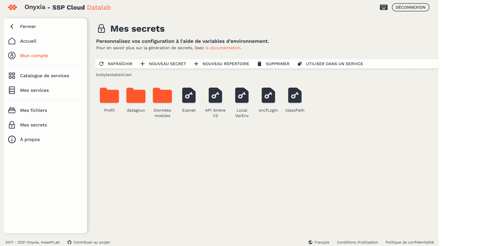
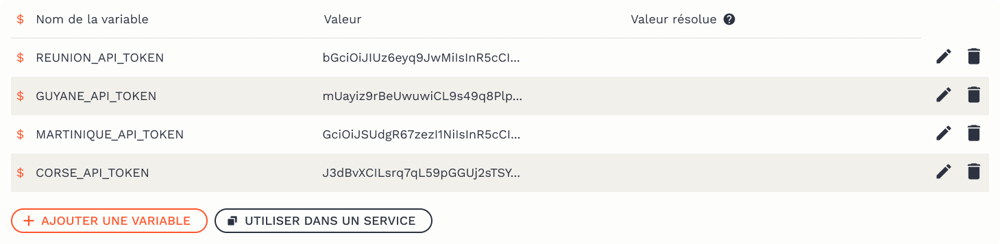

# Gestion des secrets

### Les variables d'environnement;

Il arrive que certaines informations doivent être mise à disposition d'un grand nombre d'applications, ou ne doivent pas figurer en clair dans votre code (jetons d'accès, mots de passe, etc.). L'utilisation de **variables d'environnement** permet de pouvoir accéder à ces informations depuis n'importe quel service.

Au lancement d'un service, plusieurs variables d'environnement sont déjà injectées automatiquement — par exemple, les tokens d'accès à



### Création et gestion de secrets

Sur la plateforme, les variables d'environnement sont des secrets écrits dans [Vault](https://www.vaultproject.io) (le coffre fort du Datalab) et sont chiffrées. Cela vous permet d'y stocker des jetons, des identifiants et des mots de passe. La page [Mes secrets](https://datalab.sspcloud.fr/my-secrets/) prends la forme d'un explorateur de fichiers où vous pouvez trier et hiérarchiser vos variables dans des dossiers.

#### Pour commencer :

-   Créez un nouveau dossier `+ Nouveau dossier`
-   Puis dans ce dossier, créez un nouveau secret `+ Nouveau secret`
-   Ouvrez votre secret


Chaque secret peut contenir plusieurs variables, composés de paires de clés-valeurs.

-   `+ Ajouter une variable`



Note: Les clés (nom de la variable) commencent toujours par `$` et contiennent uniquement des lettres, des chiffres et le caractère de soulignement (`_`). Par convention, les clefs s'écrivent en MAJUSCULE.

Remplissez le champ du nom de la clef puis sa valeur.

### Convertir des secrets en variables d'environnement

Une fois votre secret édité, avec ses différentes variables, vous êtes prêt à l'utiliser dans votre service.

-   Copiez le chemin du secret en cliquant sur le bouton `Utiliser dans un service`
-   Puis au moment de la configuration de votre service, allez dans l'onglet `Vault` et collez le chemin du secret dans le champ dédié


-   Créez et ouvrez votre service

Pour vérifier que vos variables d'environnement ont bien été crées, vous pouvez lancer les commandes suivantes dans le terminal du service :

```bash
# Lister toutes les variables d'environnement disponibles
env

# Afficher la valeur d'une variable d'environnement
echo $MA_VARIABLE

# Trouver toutes les variables d'environnement qui contiennent un pattern donné
env | grep -i "<PATTERN>"
```
