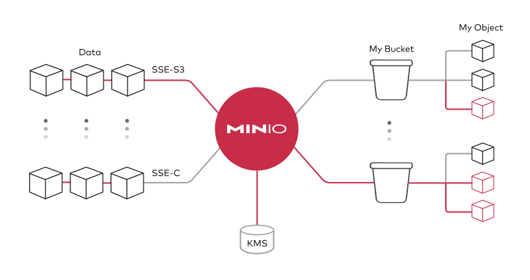

# Stockage de données

## Principes

La solution de stockage de fichiers associée au Datalab est [MinIO](https://min.io), un système de stockage d'objets basé sur le cloud, compatible avec l'API S3 d'Amazon. Concrètement, cela a plusieurs avantages :

-   les fichiers stockés sont accessibles facilement et à n'importe quel endroit : un fichier est accessible directement via une simple URL, qui peut être partagée ;
-   il est possible d'accéder aux fichiers stockés directement dans les services de _data science_ (R, Python...) proposés sur le Datalab, sans avoir besoin de copier les fichiers localement au préalable, ce qui améliore fortement la reproductibilité des analyses.



====> [secret](./secrets_fr.md)

## Gérer ses données

### Importer des données

La page [Mes fichiers](https://datalab.sspcloud.fr/my-files/) du Datalab prend la forme d'un explorateur de fichiers présentant les différents _buckets_ (dépôts) auxquels l’utilisateur a accès.

Chaque utilisateur dispose par défaut d'un _bucket_ personnel pour stocker ses fichiers. Au sein de ce _bucket_, deux options sont possibles :

-   "**créer un répertoire**" : crée un répertoire dans le _bucket_/répertoire courant, de manière hiérarchique, comme dans un système de fichiers traditionnel ;
-   "_**uploader**_** un fichier**" : _upload_ un ou plusieurs fichiers dans le répertoire courant.

Note: L'interface graphique du stockage de données sur le Datalab est encore en cours de construction. Elle peut à ce titre présenter des problèmes de réactivité. Pour des opérations fréquentes sur le stockage de fichiers, il peut être préférable d'interagir avec MinIO via le terminal.

### Partager des données

La politique de contrôle d'accès au stockage S3 **interdit par défaut** l'accès aux buckets des autres utilisateurs du SSPCloud,
**à l'exception du dossier `diffusion`** directement à la racine de chaque bucket qui est accessible en lecture seule à l'ensemble des utilisateurs.

Pour partager des données, il vous suffit ainsi de créer un dossier `diffusion` directement à la racine de votre bucket personnel
et d'y déposer les éléments que vous souhaitez rendre accessibles aux autres utilisateurs de la plateforme.

Il est également possible de configurer manuellement la politique de partage afin d'ajuster plus finement les permissions.
Pour ce faire il est actuellement nécessaire d'interagir avec **MinIO** via un terminal qui vous permet d'accéder à des fonctionnalités avancées.

En utilisant [MinIO Client](https://min.io/docs/minio/linux/reference/minio-mc.html), vous pouvez rendre un dossier publiquement accessible avec la commande suivante :

```bash
mc anonymous set download s3/<votre nom d'utilisateur>/<le dossier que vous voulez rendre publique>
```

Cette commande permet d’accorder des droits de téléchargement publics pour le dossier spécifié.

Pour des besoins plus spécifiques de contrôle d'accès, comme la gestion de droits d'accès anonymes ou restreints,
consultez la [documentation officielle de MinIO Client](https://min.io/docs/minio/linux/reference/minio-mc/mc-anonymous.html).

Un tutoriel interactif expliquant comment utiliser VSCode au sein du datalab pour partager un dossier S3
est disponible [ici](https://app.tango.us/app/workflow/Mettre-un-dossier-S3-en-publique-90b131c8ebff4a71904d1b0bdf3e108b)

Note: Dans le cadre de projets collaboratifs, il peut être intéressant pour les différents participants d'avoir accès à un espace de stockage commun.
Il est possible pour cet usage de créer des _buckets_ partagés sur MinIO.
N'hésitez pas à nous contacter via les canaux précisés sur la page "[Première utilisation](discover.qmd)" si vous souhaitez porter des projets _open-data_ sur le Datalab.

Attention: Conformément aux [conditions d'utilisation](https://datalab.sspcloud.fr/custom-resources/tos_en.md), seules des données de type _open data_ ou ne présentant aucune sensibilité peuvent être stockées sur le Datalab.
Le fait qu'un fichier ait un statut de diffusion "privé" ne suffit pas à garantir sa confidentialité.

## Utiliser des données stockées sur MinIO

Les identifiants d'accès nécessaires pour accéder à des données sur MinIO sont pré-configurés dans les différents services du Datalab, accessibles sous la forme de [variables d'environnement](./secrets_fr.md). Ainsi, l'import et l'export de fichiers à partir des services est grandement facilité.

### Configuration

---

<details>
<summary>R</summary>

En R, l'interaction avec un système de fichiers compatible S3 est rendu possible par la librairie `aws.s3`.

```r
library(aws.s3)
```

</details>

---

<details>
<summary>Python</summary>

En Python, l'interaction avec un système de fichiers compatible S3 est rendu possible par deux librairies :

-   [Boto3](https://boto3.amazonaws.com/v1/documentation/api/latest/index.html), une librairie créée et maintenue par Amazon ;
-   [S3Fs](https://s3fs.readthedocs.io/en/latest/), une librairie qui permet d'interagir avec les fichiers stockés à l'instar d'un _filesystem_ classique.

Pour cette raison et parce que S3Fs est utilisée par défaut par la librairie [pandas](https://pandas.pydata.org) pour gérer les connections S3, nous allons présenter la gestion du stockage sur MinIO via Python à travers cette librairie.

```python
import os
import s3fs

# Create filesystem object
S3_ENDPOINT_URL = "https://" + os.environ["AWS_S3_ENDPOINT"]
fs = s3fs.S3FileSystem(client_kwargs={'endpoint_url': S3_ENDPOINT_URL})
```

</details>

---

<details>
<summary>mc (terminal)</summary>

MinIO propose un client en ligne de commande (`mc`) qui permet d’interagir avec le système de stockage à la manière d'un _filesystem_ UNIX classique. Ce client est installé par défaut et accessible via un terminal dans les différents services du Datalab.

Le client MinIO propose les commandes UNIX de base, telles que ls, cat, cp, etc. La liste complète est disponible dans la [documentation du client](https://docs.min.io/docs/minio-client-complete-guide.html).

</details>

---

### Lister les fichiers d'un _bucket_

---

<details>
<summary>R</summary>

```r
aws.s3::get_bucket("donnees-insee", region = "")
```

</details>

---

<details>
<summary>Python</summary>

```python
fs.ls("donnees-insee")
```

</details>

---

<details>
<summary>mc (terminal)</summary>

Le stockage du Datalab est accessible via l'alias `s3`. Par exemple, pour lister les fichiers du bucket `donnees-insee` :

```bash
mc ls s3/donnees-insee
```

</details>

### Importer des données

---

<details>
<summary>R</summary>

```r
BUCKET <- "donnees-insee"
FILE_KEY_S3 <- "diffusion/BPE/2019/BPE_ENS.csv"

df <-
  aws.s3::s3read_using(
    FUN = readr::read_delim,
    # Mettre les options de FUN ici
    delim = ";",
    object = FILE_KEY_S3,
    bucket = BUCKET,
    opts = list("region" = "")
  )
```

</details>

---

<details>
<summary>Python</summary>

Le package S3Fs permet d'interagir avec les fichiers stockés sur MinIO comme s'il s'agissait de fichiers locaux. La syntaxe est donc très familière pour les utilisateurs de Python. Par exemple, pour importer/exporter des données tabulaires via `pandas` :

```python
import pandas as pd

BUCKET = "donnees-insee"
FILE_KEY_S3 = "diffusion/BPE/2019/BPE_ENS.csv"
FILE_PATH_S3 = BUCKET + "/" + FILE_KEY_S3

with fs.open(FILE_PATH_S3, mode="rb") as file_in:
    df_bpe = pd.read_csv(file_in, sep=";")
```

</details>

---

<details>
<summary>mc (terminal)</summary>

Pour copier les données d'un bucket sur MinIO vers le service local :

```bash
mc cp s3/donnees-insee/diffusion/BPE/2019/BPE_ENS.csv ./BPE_ENS.csv
```

</details>

---

Attention: **Copier les fichiers dans le service local n'est généralement pas une bonne pratique** : cela limite la reproductibilité des analyses, et devient rapidement impossible avec des volumes importants de données. Il est donc préférable de prendre l'habitude d'importer les données comme des fichiers directement dans `R`/`Python`.

### Exporter des données vers MinIO

---

<details>
<summary>R</summary>

```r
BUCKET_OUT = "<mon_bucket>"
FILE_KEY_OUT_S3 = "mon_dossier/BPE_ENS.csv"

aws.s3::s3write_using(
    df,
    FUN = readr::write_csv,
    object = FILE_KEY_OUT_S3,
    bucket = BUCKET_OUT,
    opts = list("region" = "")
)
```

</details>

---

<details>
<summary>Python</summary>

```python
BUCKET_OUT = "<mon_bucket>"
FILE_KEY_OUT_S3 = "mon_dossier/BPE_ENS.csv"
FILE_PATH_OUT_S3 = BUCKET_OUT + "/" + FILE_KEY_OUT_S3

with fs.open(FILE_PATH_OUT_S3, 'w') as file_out:
    df_bpe.to_csv(file_out)
```

</details>

---

<details>
<summary>mc (terminal)</summary>

Pour copier les données du service local vers un bucket sur MinIO:

```bash
mc cp chemin/local/vers/mon/fichier.csv s3/<mon_bucket>/chemin/distant/vers/mon/fichier.csv
```

</details>

---

## Renouveler des jetons d'accès (_tokens_) périmés

L'accès au stockage MinIO est possible via un _token_ (jeton d'accès) personnel, valide 7 jours, et automatiquement régénéré à échéances régulières sur le SSP Cloud. Lorsqu'un token a expiré, les services créés avant la date d'expiration (avec le précédent token) ne peuvent plus accéder au stockage ; le service concerné apparaît alors marqué en rouge dans la page [Mes Services](https://datalab.sspcloud.fr/my-services). Dans ce cas, deux possibilités :

-   ouvrir un nouveau service sur le Datalab, qui aura par défaut un nouveau token à jour ;
-   remplacer manuellement les jetons périmés par des nouveaux. Des scripts indiquant la manière de faire pour les différentes utilisations de MinIO (`R`/`Python`/`mc`) sont disponibles [ici](https://datalab.sspcloud.fr/account/storage). Il suffit de choisir le script pertinent et de l'exécuter dans son environnement de travail courant.

## Usages avancés

### Créer un compte de service

Pour des raisons de sécurité, l'authentification à MinIO utilisée par défault dans les services interactifs du SSP Cloud repose un sur jeton d'accès temporaire.
Dans le cadre de projets impliquant des traitements périodiques ou le déploiement d'applications, on peut avoir besoin d'un accès plus pérenne à des données sur MinIO.

Dans ce cas, on utilise un compte de service, c'est à dire un compte qui est rattaché à un certain projet ou une certaine application plutôt qu'à une personne. En termes techniques, au lieu de s'authentifier à MinIO via un triplet (access key id, secret access key et session token), on va utiliser un couple (access key id, secret access key) qui donne des permissions en lecture/écriture à un certain bucket de projet.

La procédure de création d'un compte de service est décrite ci-dessous.

---

<details>
<summary>Interface graphique</summary>

-   Ouvrir la [console MinIO](https://minio-console.lab.sspcloud.fr)
-   Ouvrir l'onglet `Access Keys`
-   Les informations du compte de service sont pré-générées. Il est possible de modifier l'access-key pour lui donner un nom plus simple.
-   La `policy` précisant les droits est également pré-générée. Idéalement, on restreint la policy pour qu'elle ne concerne que le/les bucket(s) du projet.
-   Une fois le compte de service généré, l'access-key et la secret-access-key peuvent être utilisées pour authentifier les services / applications au bucket spécifié

</details>

---

<details>
<summary>Terminal (mc)</summary>

-   Créer un service sur le SSP Cloud avec des accès MinIO à jour. Confirmer que la connection fonctionne avec :

```bash
mc ls s3/<nom_utilisateur>
```

-   Générer un fichier `policy.json` avec le contenu suivant, en remplaçant (deux fois) `projet-<mon_projet>` par le nom du bucket concerné :

```json
{
    "Version": "2012-10-17",
    "Statement": [
        {
            "Effect": "Allow",
            "Action": ["s3:*"],
            "Resource": [
                "arn:aws:s3:::projet-<mon_projet>",
                "arn:aws:s3:::projet-<mon_projet>/*"
            ]
        }
    ]
}
```

-   Dans un terminal, générer le compte de service avec la commande suivante :

```bash
mc admin accesskey create s3 $AWS_ACCESS_KEY_ID --access-key="<access-key>" --secret-key="<secret-access-key>" --policy="policy.json"
```

en remplaçant `<access-key>` et `<secret-access-key>` par des noms de votre choix. Idéalement, on donnera un nom simple comme access-key (ex : `sa-projet-nomduprojet`) mais une clé complexe comme secret-access-key, générable par exemple avec le client `gpg` :

```bash
gpg --gen-random --armor 1 16
```

-   Vous pouvez désormais utiliser l'access-key et la secret-access-key pour authentifier les services / applications au bucket spécifié.

</details>

---

Attention: Attention, les informations d'authentification générées n'apparaissent qu'une seule fois. Elles peuvent ensuite être stockées dans un gestionnaire de mot de passe, un service de stockage de secrets comme [Vault](https://datalab.sspcloud.fr/my-secrets), ou bien via la feature d'[options de projet](https://datalab.sspcloud.fr/project-settings) d'Onyxia qui permet d'importer le compte de service directement dans les services au moment de leur configuration.
