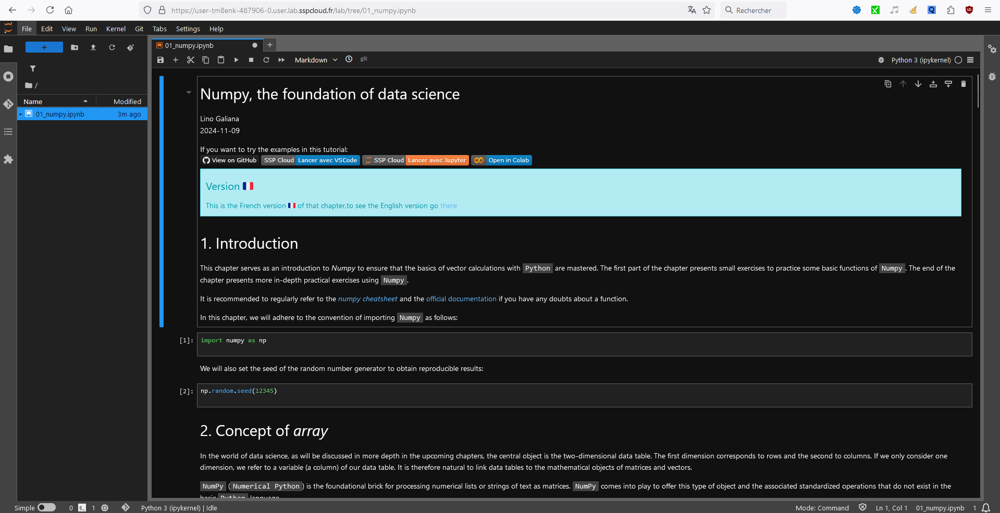
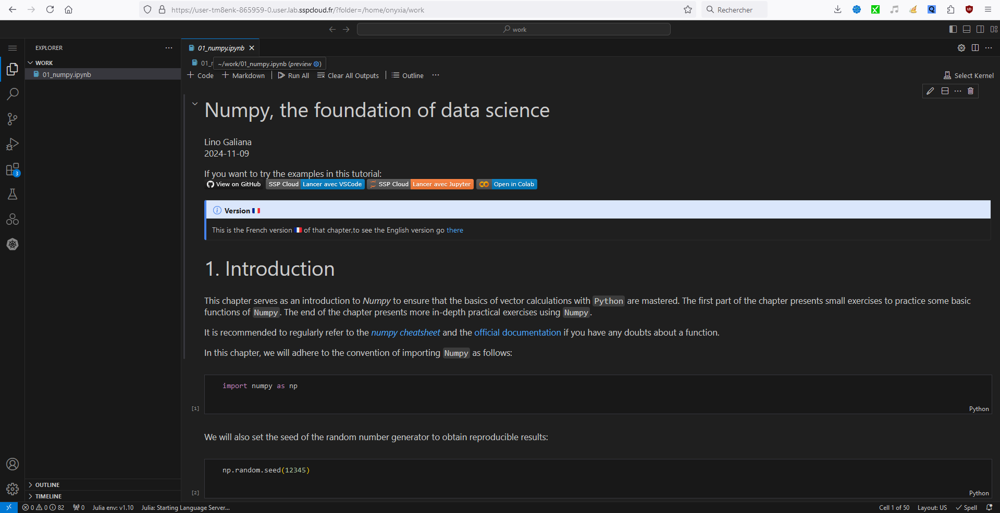
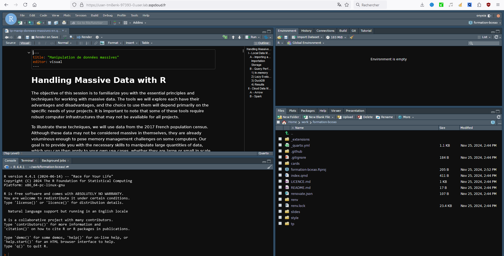

# Which materials should be used for Trainings?

When designing effective training materials, it’s crucial to select formats that engage learners and enhance comprehension. Even though PDFs, slide decks, and videos all offer valuable ways to present information, we will focus on interactive environments as they are ideal for practical training. Interactive environments allow learners to apply concepts immediately, test code in real time, and actively participate in their learning journey which promotes deeper understanding and skill retention.

In the following, we'll compare different interactive environments according to the language used. Will also be shown a way to deploy a static site on the platform using quarto.

## Using Python

🐍 In python, Jupyter Notebooks, also available in Vscode, stand out as the go-to choice. With support for rich media, widgets, and numerous extensions, it allows the integration of interactive graphs, data tables, and even forms for exercises.

## Using R

®️ In R, we can either use Rmarkdown Notebooks or LearnR which offers interactive tutorials embedded within R Markdown documents. Both of them combine explanation, code and visualization in an interactive document. However, even if learnR allows to generate interactive and more complexe elements such as quizzes making it ideal for beginner tutorials, it requires the deployment of a Shiny server which can be costly. Moreover, in learnR cells do not communicate across the entire environment hence defining global variables or managing state becomes challenging. This restriction limits the effectiveness of learnr for complex tutorials where a connected, evolving state is necessary to build on previous steps.

Overall, while learnR provides an interactive environment for R that’s suitable for simple exercises, Rmarkdown Notebooks offer a more robust, flexible, and widely-used solution. For R, traditional R Markdown or local interactive sessions are often more practical for comprehensive training sessions.

This is why, for sophisticated training materials that require smooth progression and state management, notebooks remains the preferred choice for Python or R tutorials.

Warning: Here will lie some explanation on how to deploy a static site using quarto and CI to automate its deployment. It may be moved to another tab.
