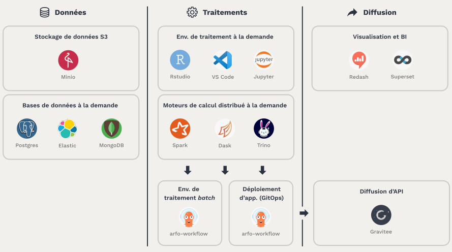

# Principles of Datalab

## A platform for collaboration

The Onyxia project stems from the recognition of common difficulties faced by data scientists in the public sector:

-   Often isolated agents, due to the relative scarcity of data skills in administration.
-   Inadequate infrastructures in terms of resources and technologies, which hinder innovation.
-   Difficulty transitioning from experimentation to production due to multiple separations (physical separation, development languages, work methods) between business units and IT production.

In response to these challenges, Datalab SSP Cloud was built to offer a collaborative platform at multiple levels:

-   Sharing a modern infrastructure centered around deploying services through containers, specifically designed for data science applications.
-   Sharing methods through the mutualization of data science services offered, to which everyone can contribute.
-   Sharing knowledge through Datalab-related training and the formation of user communities focused on its utilization.

Note: Onyxia, Datalab SSP Cloud: What are the differences?

[Onyxia](https://github.com/InseeFrLab/onyxia.git) is an open-source project that provides a web application for accessing data science services. The [Datalab SSP Cloud](https://datalab.sspcloud.fr/home) is an instance of the Onyxia project hosted at Insee.

## Fundamental principles

The architecture of Datalab is based on a set of fundamental principles:

-   Data science-oriented production by providing an infrastructure suitable for most use cases and a service catalog covering the entire data project lifecycle.
-   Choices that promote user autonomy by avoiding proprietary lock-ins and enabling access to the lower layers of the infrastructure to address advanced and specific needs.
-   A project that is 100% cloud-native and also cloud-agnostic, allowing for easy deployment on any infrastructure.
-   A completely open-source project, both in terms of its constituent components and its distribution (MIT license).

## Service offering

Datalab can be accessed through a modern and responsive [user interface](https://datalab.sspcloud.fr/home), focused on providing a great user experience. It serves as the technical connection between the different components of Onyxia:

-   Open-source technologies that represent the state of the art in container deployment and orchestration, storage, and security.
-   A service and tool catalog to support data science projects.
-   A training and documentation platform to facilitate onboarding onto the offered technologies.

The service catalog is designed to accommodate the essential needs of data scientists, from self-service development to production deployment of processes or applications. The entire data project lifecycle is covered, and the catalog of services is regularly expanded to meet users' new requirements.

## An open project

The Datalab Onyxia project is resolutely open at multiple levels:

-   The Datalab is accessible through its [web interface](https://datalab.sspcloud.fr) to all public service agents (via AgentConnect or a gouv.fr email address) as well as students from statistical schools linked to Insee (Cefil, Ensai, Ensae).
-   The open-source code and modularity of the project allow for the deployment of a customized Onyxia instance on any Kubernetes-based infrastructure cluster.
-   The project is open to external contributions, whether related to the service catalog, the graphical interface, or the arrangement of the software components it comprises.
