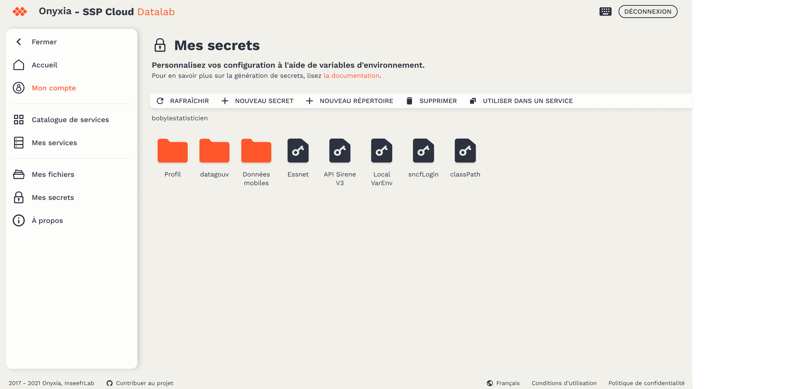
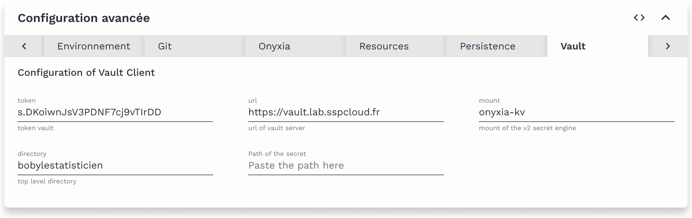

# Secrets Management

### Environment Variables

Sometimes, certain pieces of information need to be made available to a large number of applications, or they should not be directly embedded in your code (access tokens, passwords, etc.). The use of **environment variables** allows accessing this information from any service.

When a service is launched, several environment variables are automatically injected—such as access tokens for GitHub and MinIO.



### Creation and Management of Secrets

On the platform, environment variables are treated as secrets stored in [Vault](https://www.vaultproject.io) (the Datalab's safe) and are encrypted. This enables you to store tokens, credentials, and passwords securely. The [My Secrets](https://datalab.sspcloud.fr/my-secrets/) page is designed like a file explorer, allowing you to sort and organize your variables into folders.

#### Getting Started:

-   Create a new folder with `+ New folder`.
-   Then, within this folder, create a new secret with `+ New secret`.
-   Open your secret.


Each secret can contain multiple variables, consisting of key-value pairs.

-   `+ Add a variable`


Note: The keys (variable names) always begin with `$` and contain only letters, numbers, and the underscore character (`_`). By convention, keys are written in UPPERCASE.

Fill in the name of the key and its value.

### Converting Secrets into Environment Variables

Once your secret is edited, along with its different variables, you are ready to use it in your service.

-   Copy the secret's path by clicking on the `Use in a service` button.
-   Then, during the configuration of your service, go to the `Vault` tab and paste the secret's path in the dedicated field.



-   Create and open your service.

To verify that your environment variables have been successfully created, you can run the following commands in the service terminal:

```bash
# List all available environment variables
env

# Display the value of an environment variable
echo $MY_VARIABLE

# Find all environment variables containing a given pattern
env | grep -i "<PATTERN>"
```
