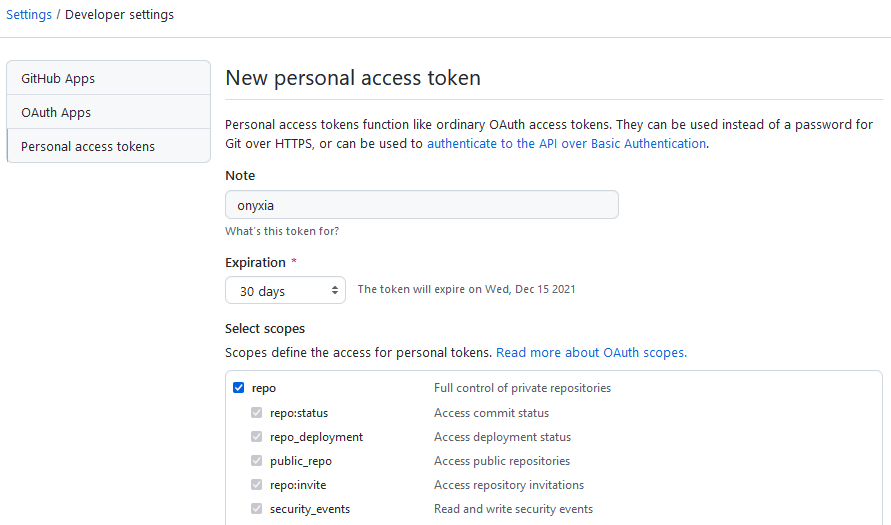
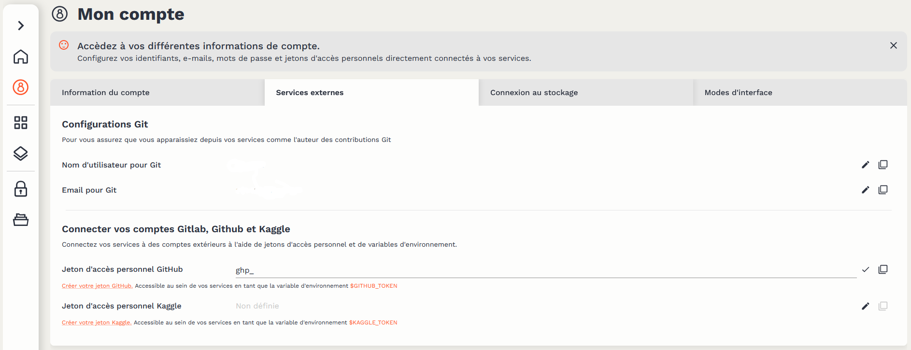
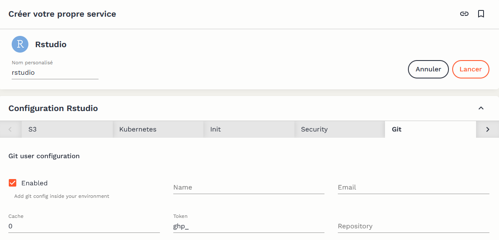

# Version control

## Why use version control?

Datalab is a shared platform: the resources used by services are shared among different users. As such, Datalab services operate on the model of ephemeral containers: in standard usage, the user launches a service, performs data processing, saves the code that enabled the processing, and deletes the service instance. Saving this code is greatly facilitated by the use of version control.

This performance consideration should not be seen as a constraint, however: version control is an essential development best practice. The benefits are numerous, both individually:

-   the local project is synchronized with a remote server, making loss of code virtually impossible;
-   the complete history of choices and changes made to the project is preserved;
-   the user can browse this history to look for changes that may have created errors, and decide at any time to revert to an earlier version of the project or certain files.

… and for collaborative projects:

-   simultaneous work on the same project is possible without risk of loss;
-   the user can share his modifications while benefiting from those of others;
-   it becomes possible to contribute to open-source projects, for which the use of Git is widely standard.

Warning: This tutorial aims to present how version control can be easily implemented using the tools available on Datalab. It does not present how Git works and therefore presupposes some familiarity with the tool. Many online resources can serve as an introduction; R users can, for example, follow [this training](https://inseefrlab.github.io/formation-bonnes-pratiques-git-R/) and Python users [this course chapter](https://pythonds.linogaliana.fr/content/git/exogit.html).

## GitHub integration with Datalab

### Why GitHub?

Although it is possible to use Git offline, the whole point of version control lies in synchronizing your local copy of a project (clone) with a remote repository (remote). Different software forges allow this synchronization of Git projects, the best known being [GitHub](https://github.com) and [GitLab](https://about.gitlab.com). Since the former now enjoys much greater visibility — for example, Insee's repositories, [InseeFr](https://github.com/InseeFrL) and [InseeFrLab](https://github.com/InseeFrLab), are on GitHub — Datalab offers facilitated integration with GitHub, which we present in this tutorial.

Warning: The following requires a [GitHub account](https://github.com/join).

Note: While using Datalab with the GitHub platform is facilitated, it is by no means mandatory: it is still possible to use the software forge of your choice for project synchronization. A [forge based on GitLab](https://git.lab.sspcloud.fr) is also available to Datalab users.

### Creating an access token

Synchronization with a remote repository requires authentication with GitHub. This is done using a personal access token, which must be generated from the user's GitHub account. The generation service is accessible at [this address](https://github.com/settings/tokens). The [GitHub documentation](https://docs.github.com/en/authentication/keeping-your-account-and-data-secure/creating-a-personal-access-token) provides illustrations to guide the process.

To generate a token, it is necessary to choose a token name, an expiration date, and access rights (_scope_). It is recommended to choose a short expiration date (30 days) and limited access (_repo_ only) to reduce security risks in case the token is maliciously exposed.



Once the token is generated, it will be displayed on the screen. A token can only be viewed once; if lost, a new one must be generated.

### Adding the access token to Datalab

It is recommended to add access tokens to a password manager. Alternatively, the token can be added to the "External Services" configuration of the user account on Datalab, which allows the token to be directly accessible within the services offered on the platform.



Warning: Be sure to use the email address associated with your GitHub account in the "Account Information". It is this address that effectively links the commits you make to your GitHub account.

## Using Git with Datalab services

Git is pre-configured to work natively with the relevant Datalab services. When opening a service, it is possible to configure certain elements. If you have added a GitHub access token to your Datalab account, it will be pre-configured. It is also possible to indicate the **complete** URL of a Git repository (e.g., [https://github.com/InseeFrLab/onyxia](https://github.com/InseeFrLab/onyxia)), which will then be cloned into the instance's workspace during initialization.



### Via the terminal

The GitHub access token is available in the terminals of different services via the environment variable `$GIT_PERSONAL_ACCESS_TOKEN`. To avoid having to authenticate for every operation involving the remote repository (clone, push, and pull), it is recommended to clone it, including the access token in the HTTPS link, using the following command:

```
git clone https://${GIT_PERSONAL_ACCESS_TOKEN}@github.com/<owner>/<repo>.git
```

where `<owner>` and `<repo>` should be replaced with the GitHub username and repository name, respectively.

### Via integrated graphical interfaces

The main code production services available on Datalab have a graphical interface to facilitate the use of Git:

-   RStudio: RStudio provides a native and fairly comprehensive graphical interface for Git. The [utilitR documentation](https://www.book.utilitr.org/03_fiches_thematiques/fiche_git_utilisation) presents its operation in detail.
-   Jupyter: the [jupyterlab-git plugin](https://github.com/jupyterlab/jupyterlab-git) provides a (fairly basic) interface between Jupyter and Git.
-   VSCode: VSCode natively offers a well-integrated graphical interface with Git and GitHub. A [detailed documentation](https://code.visualstudio.com/docs/editor/versioncontrol) presents the possibilities of the tool.

Warning: Graphical interfaces make it easier to get started with Git but never completely replace the use of the tool via a terminal due to necessarily imperfect integration. Therefore, it is useful to familiarize yourself with using Git via the terminal as early as possible.
