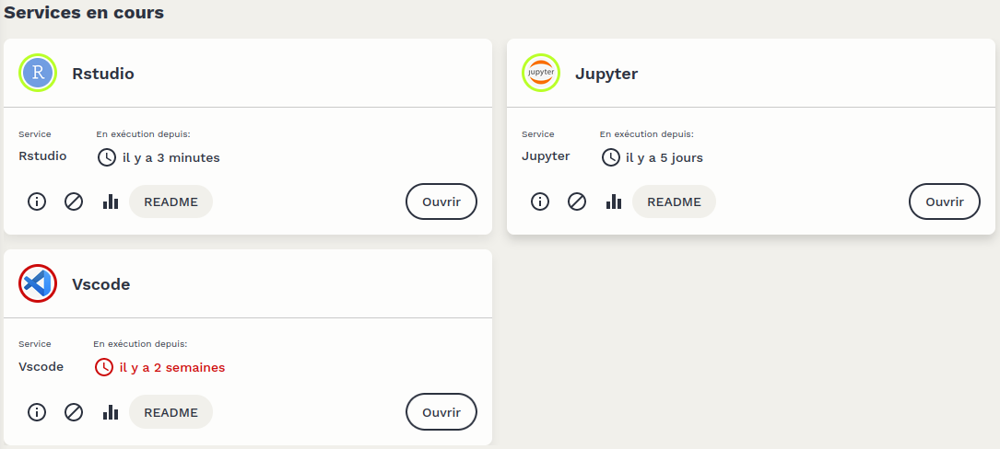

# Welcome to the SSP Cloud!

An open instance of the [Onyxia](https://www.onyxia.sh/) project, the [SSP Cloud](https://datalab.sspcloud.fr/) is a shared data processing platform. This “Datalab” is dedicated to experimenting with datascience methods based on open data. In this tutorial, we'll take you on a guided tour of the Datalab, to help you get up and running quickly.

Warning: The terms of use for the SSP Cloud can be found at [this address](https://datalab.sspcloud.fr/terms). We remind you that the SSP Cloud is intended exclusively for the processing of **public and non-sensitive data**. Projects involving non-open data for experimentation can be carried out in consultation with the Onyxia team, subject to compliance with project-specific security rules.

## Service Catalog

The [service catalog](https://datalab.sspcloud.fr/catalog/inseefrlab-helm-charts-datascience) is at the core of the SSP Cloud's usage. It offers a set of services for statistical data processing and complete management of data science projects.

### Launching a Service

To launch a service, simply click on the `Launch` button of the desired service.

A page centered on the requested service will then open, offering several options:

-   Click again on the `Launch` button to start the service with its default configuration.
-   Customize the name that the instance will have once the service is launched.
-   Unfold a configuration menu to customize the service's configuration before launching it.
-   Save a customized configuration by clicking on the bookmark at the top right of the service.

Info: The detailed configuration of services is an advanced usage and is not covered in this tutorial but in other pages of this documentation site.

### Using a Service

Launching a service automatically takes you to the [My Services](https://datalab.sspcloud.fr/my-services) page, where all active instances on the user's account are listed.

Once the service is launched, an `Open` button appears, allowing access to the service. A password — and, depending on the services, a username — is generally required to use the service. This information is available in the service's `README`, which can be accessed by clicking on the button of the same name.

### Deleting an Instance

Deleting an instance of a service is done simply by clicking on the trash can icon below the instance.

Caution: For some services, deleting an instance will also delete all associated data, and this action is irreversible. Therefore, it is essential to always read the `README` associated with the instance, which specifies the consequences of deleting the instance. In general, it is crucial to ensure that the data and code used are backed up before deleting the instance. Ideally, version your code with Git and regularly back up the data using MinIO (S3 storage system).

Caution: The resources made available for executing services are shared among different SSP Cloud users. Please make sure not to leave active services that you no longer use. We sometimes systematically remove inactive instances after a certain period to free up resources.

## Support

Support and assistance for using the SSP Cloud are provided through two communication channels:

-   On [the Onyxia Slack](https://join.slack.com/t/3innovation/shared_invite/zt-1bo6y53oy-Y~zKzR2SRg37pq5oYgiPuA) in the #sspcloud channel. Any questions about using the SSP Cloud or suggestions for improvement are welcome there.
-   In a [dedicated room](https://matrix.to/#/#SSPCloudXDpAw6v:agent.finances.tchap.gouv.fr) of the French state inter-ministerial instant messaging service [Tchap](https://www.tchap.gouv.fr) for French public agents.
